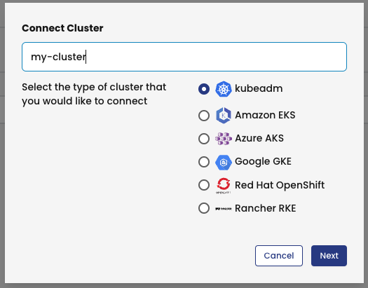

Create Calico Cloud trial account and login
===============

Use the calico cloud tab to sign up for a 14 day trial account :


Once you activate your account with your email, login to calico cloud using the same tab

Install calico cloud
===============
Click the "Managed Cluster" in your left side of browser.


Click on "connect cluster"


Enter a name to your cluster, choose kubeadm and click next



Copy the installation script and use the terminal tab to run it in your cluster


🚀 Validate what we have done
==============

Use the terminal to check the calico cloud instalation status:

```
kubectl get installer default --namespace calico-cloud -o jsonpath --template '{.status}'
```
Make sure that state is **done**

Installation process will take around 5 minutes

Configure log flush intervals in the cluster, we will use 10s instead of default value 300s for lab testing only.

```
kubectl patch felixconfiguration.p default -p '{"spec":{"flowLogsFlushInterval":"10s"}}'
kubectl patch felixconfiguration.p default -p '{"spec":{"dnsLogsFlushInterval":"10s"}}'
kubectl patch felixconfiguration.p default -p '{"spec":{"flowLogsFileAggregationKindForAllowed":1}}'
```

🏁 Finish
=========

To complete this challenge, press **NEXT**.
