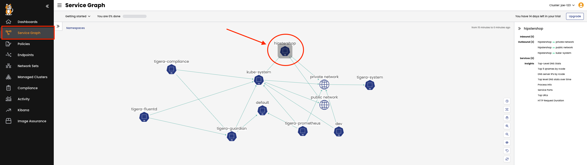
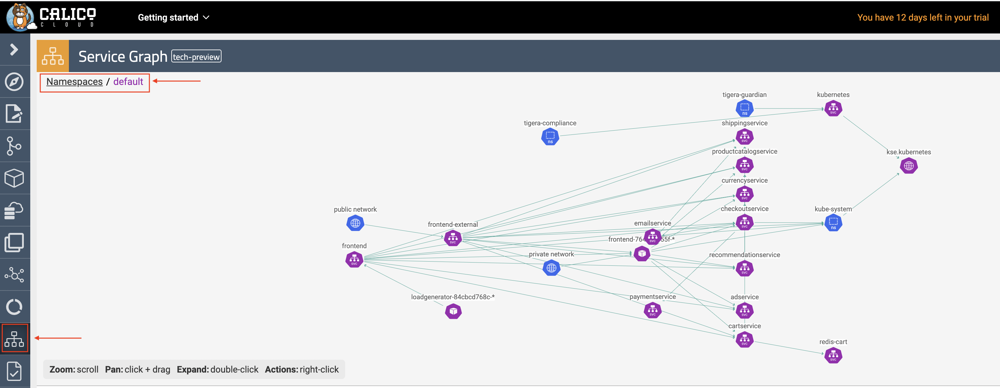

🚀 Let's build an app
==============
First, let's create a namespace called 'hipstershop' for the application:

```
kubectl create namespace hipstershop
```

Next we will deploy the Online Boutique (Hipstershop) application to the namespace.

```
kubectl apply -n hipstershop -f https://raw.githubusercontent.com/GoogleCloudPlatform/microservices-demo/main/release/kubernetes-manifests.yaml
```

Verify Pods are Running

```
kubectl get pods -n hipstershop
```

**Deploy Network-MultiTool Pod in the default namespace**

The Network-MultiTool pod will be used in two namespaces to test the created network policies.

First, deploy the MultiTool into the default namespace:

```bash
kubectl run multitool --image=wbitt/network-multitool
```

**Deploy a second copy of Network-Multitool to the hipstershop namespace**

Next, deploy a copy of the Mutlitool into the hipstershop namespace:

```bash
kubectl run multitool -n hipstershop --image=wbitt/network-multitool
```

Verify that both pods are up and running:

```bash
kubectl get pods -A | grep multitool
```


✅ Service graph
==============

Use Calico Cloud UI to discover the hipstershop application using the "service graph". To view resources in the `hipstershop` namespace click on the `Service Graph` icon on the left menu which will display a top level view of the cluster resources:



Double click on the `Hipstershop` Namespace as highlighted to bring only resources in the `hipstershop` namespace in view along with other resources communicating into or out of the `hipstershop` Namespace.



🏁 Finish
=========

To complete this challenge, press **Check**.
