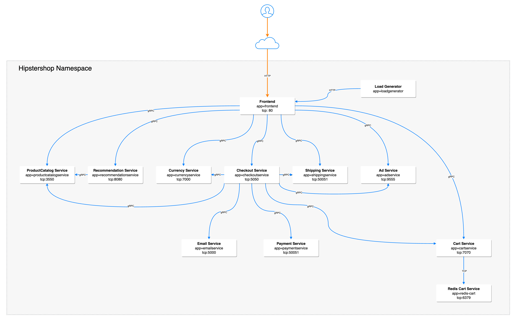
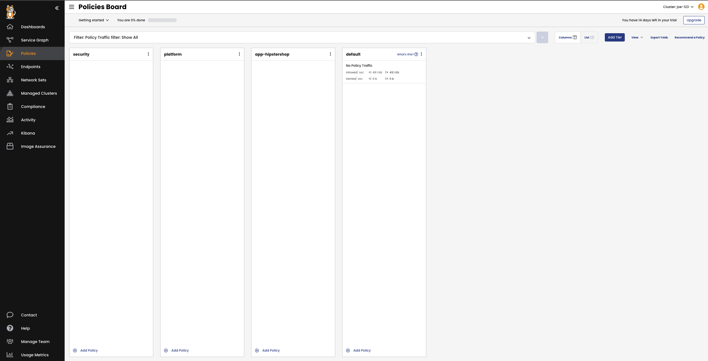

💡 Labeling
================

**(In kubernetes world, labels will make your life easier)** 

First, lets manually apply a label to the multitool pod. 

```bash
kubectl label pod multitool mylabel=true
```

We can then see the resulting label using:

```bash
kubectl get pod multitool --show-labels
```

```
NAME        READY   STATUS    RESTARTS   AGE    LABELS
multitool   1/1     Running   0          2d6h   mylabel=true,run=multitool
```

Now lets attach a PCI label to our application pods. Rather than apply the label one by one, label all pods in the hipstershop namespace with 'pci=true' with the following command:

```bash
kubectl label pods --all -n hipstershop pci=true
```

Then, verify the labels are applied:

```bash
kubectl get pods -n hipstershop --show-labels
```
```bash
tigera@bastion:~$ kubectl get pods -n hipstershop --show-labels
NAME                                     READY   STATUS    RESTARTS   AGE   LABELS
adservice-6569cd7bb6-v9v54               1/1     Running   0          28h   app=adservice,pci=true,pod-template-hash=6569cd7bb6
cartservice-f45c6bd9b-4h4pn              1/1     Running   22         28h   app=cartservice,pci=true,pod-template-hash=f45c6bd9b
checkoutservice-8596f74dc8-cj9vf         1/1     Running   0          28h   app=checkoutservice,pci=true,pod-template-hash=8596f74dc8
currencyservice-85599889d4-kspv5         1/1     Running   0          28h   app=currencyservice,pci=true,pod-template-hash=85599889d4
emailservice-78778f689b-dfljq            1/1     Running   0          28h   app=emailservice,pci=true,pod-template-hash=78778f689b
frontend-7cb647d79c-kz2gq                1/1     Running   0          28h   app=frontend,pci=true,pod-template-hash=7cb647d79c
loadgenerator-6cdf76b6d4-vscmj           1/1     Running   0          28h   app=loadgenerator,pci=true,pod-template-hash=6cdf76b6d4
multitool                                1/1     Running   0          28h   pci=true,run=multitool
paymentservice-868bc5ffcd-4k5sx          1/1     Running   0          28h   app=paymentservice,pci=true,pod-template-hash=868bc5ffcd
productcatalogservice-6948774f48-5xznt   1/1     Running   0          28h   app=productcatalogservice,pci=true,pod-template-hash=6948774f48
recommendationservice-cd689fc7d-h6w59    1/1     Running   0          28h   app=recommendationservice,pci=true,pod-template-hash=cd689fc7d
redis-cart-74594bd569-vg25j              1/1     Running   0          28h   app=redis-cart,pci=true,pod-template-hash=74594bd569
shippingservice-85c8d66568-jrdsf         1/1     Running   0          28h   app=shippingservice,pci=true,pod-template-hash=85c8d66568
```

Now that all pods are labelled, lets start applying some policies.

💡 Policy Tiers
================

For this workshop, we'll be creating 3 tiers in the cluster and utilizing the default tier as well:

**security** - Global security tier with controls such as PCI restrictions.

**platform** - Platform level controls such as DNS policy and tenant level isolation.

**app-hipster** - Application specific tier for microsegmentation inside the application.

To create the tiers apply the following manifest:

```yaml
kubectl apply -f -<<EOF
apiVersion: projectcalico.org/v3
kind: Tier
metadata:
  name: app-hipstershop
spec:
  order: 400
---
apiVersion: projectcalico.org/v3
kind: Tier
metadata:
  name: platform
spec:
  order: 300
---   
apiVersion: projectcalico.org/v3
kind: Tier
metadata:
  name: security
spec:
  order: 200
EOF
```

💡  General Policies
================

After creating our tiers, we'll apply some general policies to them before we start creating our main policies. These policies include allowing traffic to kube-dns from all pods, passing traffic that doesn't explicitly match in the tier and finally a default deny policy.

```bash
kubectl apply -f https://raw.githubusercontent.com/JosephYostos/Compliance-workshop/main/03-create-policies/mainfest/2.2-pass-dns-default-deny-policy.yaml
```


💡  Security Policies
================
Now that we have our foundation in the Policy Tiers, we need to start applying policy to restrict traffic. The first policy we will apply will only allow traffic to flow between pods with the label of 'pci=true'. Pods without the 'pci=true' label will also be able to freely communicate with each other.

We will also add a 'pci-allowlist' policy because we need a way to allow traffic to the frontend of the application as well as allowing DNS lookups from the PCI pods to the kube-dns system.

```bash
kubectl apply -f https://raw.githubusercontent.com/JosephYostos/Compliance-workshop/main/03-create-policies/mainfest/2.3-pci-isolation-policy.yaml
```
Now we can verify this is working as expected

💡  PCI Policy Testing
================
To test, we'll use our MultiTool pods both inside of the 'hipstershop' namespace and in the default namespace. Before we can complete the testing from the default namespace, we'll have to apply a policy that allows egress traffic from the pods in the default namespace. This is because we're applying an egress policy in an earlier step, so now, if we don't allow it at some point it will be denied by default. To get around this we'll apply this policy:

```bash
kubectl apply -f https://raw.githubusercontent.com/JosephYostos/Compliance-workshop/main/03-create-policies/mainfest/2.4-default-egress-policy.yaml
```


Before we start testing, we're going to get the addresses of all the Online Boutique services so we can use them in the testing to follow. To do this we'll run the following command and keep the output handy:

```bash
kubectl get svc -n hipstershop -o wide
```

Example output:
```bash
$ kubectl get svc -n hipstershop
NAME                    TYPE           CLUSTER-IP     EXTERNAL-IP     PORT(S)        AGE
adservice               ClusterIP      10.0.131.26    <none>          9555/TCP       4h37m
cartservice             ClusterIP      10.0.214.232   <none>          7070/TCP       4h37m
checkoutservice         ClusterIP      10.0.162.114   <none>          5050/TCP       4h37m
currencyservice         ClusterIP      10.0.227.232   <none>          7000/TCP       4h37m
emailservice            ClusterIP      10.0.72.153    <none>          5000/TCP       4h37m
frontend                ClusterIP      10.0.41.230    <none>          80/TCP         4h37m
frontend-external       LoadBalancer   10.0.209.155   51.143.16.163   80:30113/TCP   4h37m
paymentservice          ClusterIP      10.0.85.72     <none>          50051/TCP      4h37m
productcatalogservice   ClusterIP      10.0.60.54     <none>          3550/TCP       4h37m
recommendationservice   ClusterIP      10.0.20.46     <none>          8080/TCP       4h37m
redis-cart              ClusterIP      10.0.160.215   <none>          6379/TCP       4h37m
shippingservice         ClusterIP      10.0.77.30     <none>          50051/TCP      4h37m
```
First, from inside of the 'hipstershop' namespace, we'll exec into the multitool pod and connect to the 'frontend' as well as try to connect to the 'cartservice' directly. To do this we will use NetCat and Curl.

From the above output, we know that our 'cartservice' is has an address of '10.0.214.232'.

Exec into the pod:
```bash
kubectl exec -n hipstershop multitool --stdin --tty -- /bin/bash
```

Test connectivity to 'cartservice' directly:
```bash
bash-5.1# nc -zvw 3 10.0.214.232 7070
10.0.214.232 (10.0.214.232:7070) open
```
And connectivity to the 'frontend':
```bash
bash-5.1# curl -I 10.0.41.230
HTTP/1.1 200 OK
Set-Cookie: shop_session-id=1939f999-1237-4cc7-abdb-949423eae483; Max-Age=172800
Date: Wed, 26 Jan 2022 20:14:20 GMT
Content-Type: text/html; charset=utf-8
```
As expected, we can reach both services from a pod with the pci=true label.

Now lets try from a pod without the 'pci=true' label that is outside of the namespace. To do this, we'll use our multitool pod in the default namespace:

```bash
kubectl exec multitool --stdin --tty -- /bin/bash
```

```bash
bash-5.1# nc -zvw 3 10.0.214.232 7070
nc: 10.0.214.232 (10.0.214.232:7070): Operation timed out
```
```bash
bash-5.1# curl -I 10.49.14.192
HTTP/1.1 200 OK
Set-Cookie: shop_session-id=772c5095-11f5-4bb0-9d42-0ef8dcda9707; Max-Age=172800
Date: Wed, 26 Jan 2022 20:21:54 GMT
Content-Type: text/html; charset=utf-8
```

As expected, we can connect to 'frontend' because it has a policy allowing it but we can't connect to the cartservice on 7070 because of our PCI isolation policy.

Let's add the 'pci=true' label to the pod:

```bash
kubectl label pod multitool pci=true
```

And we can test again:

```bash
tigera@bastion:~$ kc exec multitool --stdin --tty -- /bin/bash
```
```bash
bash-5.1# nc -zvw 3 10.0.214.232 7070
10.0.214.232 (10.0.214.232:7070) open
```
We can successfully connect from the MultiTool pod in the default namespace to a service in the hipstershop namespace as long as they both have the 'pci=true' label.

💡 Microsegmentation with Hipstershop
===============
To perform the microsegmentation we will need to know more about how the application communicates between the services. The following diagram provides all the information we need to know:



After reviewing the diagram we can come up with a table of rules that looks like this:

```
Source Service | Destination Service | Destination Port
--- | --- | ---
cartservice | redis-cart | 6379
checkoutservice | cartservice | 7070
checkoutservice | emailservice | 8080
checkoutservice | paymentservice | 50051
checkoutservice | productcatalogservice | 3550
checkoutservice | shippingservice | 50051
checkoutservice | currencyservice | 7000
checkoutservice | adservice | 9555
frontend | cartservice | 7070
frontend | productcatalogservice | 3550
frontend | recommendationservice | 8080
frontend | currencyservice | 7000
frontend | checkoutservice | 5050
frontend | shippingservice | 50051
frontend | adservice | 9555
loadgenerator | frontend | 8080
recommendationservice | productcatalogservice | 3550
```
This results in the following policy which we can now apply to the app-hipstershop tier using:

```bash
kubectl apply -f https://raw.githubusercontent.com/JosephYostos/Compliance-workshop/main/03-create-policies/mainfest/2.6-hipstershop-policy.yaml
```
we will have to go back and make a modification to our PCI Restriction and Tenant Isolation Policies to completely enable our microsegmentation. Right now the PCI policy allows communication between all the 'pci=true' pods and the Tenant Isolation policy allows open communication between pods with the 'tenant=hipstershop' label. We want to pass this decision to the 'app-hipstershop' tier so we will apply the following update:

```bash
kubectl apply -f https://raw.githubusercontent.com/JosephYostos/Compliance-workshop/main/03-create-policies/mainfest/2.7-pci-policy-update.yaml
kubectl apply -f https://raw.githubusercontent.com/JosephYostos/Compliance-workshop/main/03-create-policies/mainfest/2.8-tenant-isolation-update.yaml
```

Once this is applied, the policy inside of the 'app-hipstershop' tier should apply and give us microsegmentation inside of our application namespace. The Policy Board should show traffic being allowed by most of our policies:



💡 Limiting Egress Access
============
Now that we've implemented our microsegmentation policy, there's one last type of policy we should apply; a global egress access policy.

A global egress access policy allows us to limit what external resources the pods in our cluster can reach. To build this we need two pieces:
1. A GlobalNetworkSet with a list of approved external domains.
2. An egress policy that applies globally and references our GlobalNetworkSet.

First, lets created our list of allowed domains:

```yaml
kubectl apply -f -<<EOF
kind: GlobalNetworkSet
apiVersion: projectcalico.org/v3
metadata:
  name: global-trusted-domains
  labels:
    external-endpoints: global-trusted
spec:
  nets: []
  allowedEgressDomains:
    - google.ca
    - tigera.io
EOF
```

And now we'll apply our policy into the security tier and have it reference our list of trusted domains we just created.

```yaml
kubectl apply -f -<<EOF
apiVersion: projectcalico.org/v3
kind: GlobalNetworkPolicy
metadata:
  name: security.global-trusted-domains
spec:
  tier: security
  order: 112.5
  selector: ""
  namespaceSelector: ""
  serviceAccountSelector: ""
  egress:
    - action: Allow
      source: {}
      destination:
        selector: external-endpoints == "global-trusted"
  doNotTrack: false
  applyOnForward: false
  preDNAT: false
  types:
    - Egress
EOF
```

Now any pod that doesn't have a more permissive egress policy will only be allowed to access 'google.ca' and 'tigera.io' and we can test this with our 'multitool' pod in the 'hisptershop' namespace.

First we'll exec into our multitool pod in the 'hipstershop' namespace:
```bash
kubectl exec -n hipstershop multitool --stdin --tty -- /bin/bash
```

And then we'll try to connect to a few domains (google.ca, tigera.io, github.com)
```bash
bash-5.1# ping -c 3 google.ca
PING google.ca (172.217.13.195) 56(84) bytes of data.
64 bytes from yul03s05-in-f3.1e100.net (172.217.13.195): icmp_seq=1 ttl=107 time=2.06 ms
64 bytes from yul03s05-in-f3.1e100.net (172.217.13.195): icmp_seq=2 ttl=107 time=1.75 ms
64 bytes from yul03s05-in-f3.1e100.net (172.217.13.195): icmp_seq=3 ttl=107 time=1.73 ms

--- google.ca ping statistics ---
3 packets transmitted, 3 received, 0% packet loss, time 2004ms
rtt min/avg/max/mdev = 1.729/1.846/2.056/0.148 ms
bash-5.1# ping -c 3 tigera.io
PING tigera.io (162.159.135.42) 56(84) bytes of data.
64 bytes from 162.159.135.42 (162.159.135.42): icmp_seq=1 ttl=46 time=8.41 ms
64 bytes from 162.159.135.42 (162.159.135.42): icmp_seq=2 ttl=46 time=8.53 ms
64 bytes from 162.159.135.42 (162.159.135.42): icmp_seq=3 ttl=46 time=8.10 ms

--- tigera.io ping statistics ---
3 packets transmitted, 3 received, 0% packet loss, time 2001ms
rtt min/avg/max/mdev = 8.103/8.347/8.532/0.180 ms
bash-5.1# ping -c 3 github.com
PING github.com (140.82.112.3) 56(84) bytes of data.

--- github.com ping statistics ---
3 packets transmitted, 0 received, 100% packet loss, time 2028ms
```

As expected our pings to google.ca and tigera.io are successful but our ping to github.com is denied.

Now our policies are complete. 

Finish
============
Press **Next** to continue to the next challenge.
