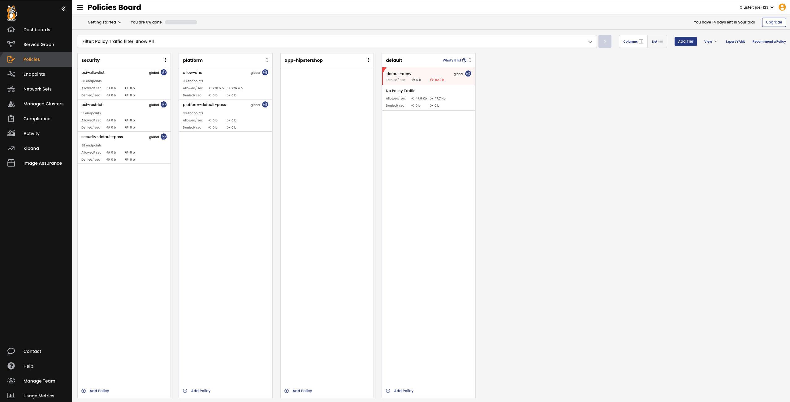
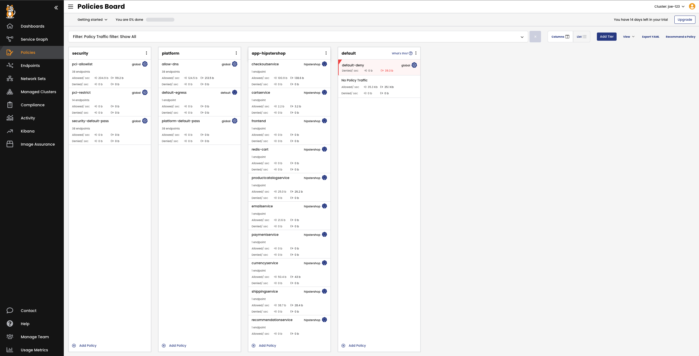

 Labeling
================

💡 **In kubernetes world, labels are essential connect identifying metadata with Kubernetes objects.**

First, lets attach a PCI label to our application pods. Rather than apply the label one by one, label all pods in the hipstershop namespace with 'pci=true' with the following command:

```bash
kubectl label pods --all -n hipstershop pci=true
```

Then, verify the labels are applied:

```bash
kubectl get pods -n hipstershop --show-labels | grep pci=true
```

```bash
tigera@bastion:~$ kubectl get pods -n hipstershop --show-labels
NAME                                     READY   STATUS    RESTARTS   AGE   LABELS
adservice-6569cd7bb6-v9v54               1/1     Running   0          28h   app=adservice,pci=true,pod-template-hash=6569cd7bb6
cartservice-f45c6bd9b-4h4pn              1/1     Running   22         28h   app=cartservice,pci=true,pod-template-hash=f45c6bd9b
checkoutservice-8596f74dc8-cj9vf         1/1     Running   0          28h   app=checkoutservice,pci=true,pod-template-hash=8596f74dc8
currencyservice-85599889d4-kspv5         1/1     Running   0          28h   app=currencyservice,pci=true,pod-template-hash=85599889d4
emailservice-78778f689b-dfljq            1/1     Running   0          28h   app=emailservice,pci=true,pod-template-hash=78778f689b
frontend-7cb647d79c-kz2gq                1/1     Running   0          28h   app=frontend,pci=true,pod-template-hash=7cb647d79c
loadgenerator-6cdf76b6d4-vscmj           1/1     Running   0          28h   app=loadgenerator,pci=true,pod-template-hash=6cdf76b6d4
multitool                                1/1     Running   0          28h   pci=true,run=multitool
paymentservice-868bc5ffcd-4k5sx          1/1     Running   0          28h   app=paymentservice,pci=true,pod-template-hash=868bc5ffcd
productcatalogservice-6948774f48-5xznt   1/1     Running   0          28h   app=productcatalogservice,pci=true,pod-template-hash=6948774f48
recommendationservice-cd689fc7d-h6w59    1/1     Running   0          28h   app=recommendationservice,pci=true,pod-template-hash=cd689fc7d
redis-cart-74594bd569-vg25j              1/1     Running   0          28h   app=redis-cart,pci=true,pod-template-hash=74594bd569
shippingservice-85c8d66568-jrdsf         1/1     Running   0          28h   app=shippingservice,pci=true,pod-template-hash=85c8d66568
```

Now that all pods are labeled, lets start applying some policies.

 Policy Tiers
================

💡 *Tiers* are a hierarchical construct used to group policies and enforce higher precedence policies that cannot be circumvented by other teams.

Next, determine the priority of policies in tiers (from top to bottom). Tiers are ordered from left to right, starting with the highest priority tiers. Policies are processed in sequential order from top to bottom.

In the following example,  "platform" and "security" tiers use Calico's global network policies that apply to all pods, while developer teams can safely manage pods within namespaces for their applications and microservices using "app-hipstershop" tier


For this workshop, create 3 tiers in the cluster and utilize the default tier as well:

**security** - Global security tier with controls such as PCI restrictions.

**platform** - Platform level controls such as DNS policy and tenant level isolation.

**app-hipster** - Application specific tier for microsegmentation inside the application.

To create the tiers apply the following manifest:

```yaml
kubectl apply -f -<<EOF
apiVersion: projectcalico.org/v3
kind: Tier
metadata:
  name: app-hipstershop
spec:
  order: 400
---
apiVersion: projectcalico.org/v3
kind: Tier
metadata:
  name: platform
spec:
  order: 300
---
apiVersion: projectcalico.org/v3
kind: Tier
metadata:
  name: security
spec:
  order: 200
EOF
```

Now go to Calico Cloud and check the created tiers under `policies` page


  Global Policies
================

💡*Global* Network policies is not a namespaced resource, it applies to the whole cluster.

After creating tiers, apply some general global policies to them before creating application specific policies. These policies include allowing traffic to kube-dns from all pods, passing traffic that doesn't explicitly match in the tier and finally a default deny policy.

```bash
kubectl apply -f https://raw.githubusercontent.com/JosephYostos/Compliance-workshop/main/03-security-policies/mainfest/2.2-pass-dns-default-deny-policy.yaml
```

Now go to Calico Cloud and check the created policies under each tier


  Security Policies
================
Now that we have our foundation in the Policy Tiers, start applying policies to restrict traffic.

In this example, we will apply two global policies:
- pci-restrict:  allow traffic to flow between pods with the label 'pci=true'.
- pci-allowlist:  allow ingress traffic to the frontend over port 8080

```bash
kubectl apply -f https://raw.githubusercontent.com/JosephYostos/Compliance-workshop/main/03-security-policies/mainfest/2.3-pci-isolation-policy.yaml
```
Now go to Calico Cloud and make sure the two policies are created under the security tier.



Verfiy if the policies are working as intended.

  PCI Policy Testing
================
To test, use MultiTool pods both inside of the 'hipstershop' namespace and in the default namespace.

Run two tests:
- First, Test connectivity  inside the 'hipstershop' namespace where all pods has label 'pci=true'.
- Second, Test connectivity from pod outside hipstershop namespace without the 'pci=true' label.

Before we start we need to allow egress traffic from the pods in the default namespace:

```bash
kubectl apply -f https://raw.githubusercontent.com/JosephYostos/Compliance-workshop/main/03-security-policies/mainfest/2.4-default-egress-policy.yaml
```

Now, let's run the test

1 - Test connectivity inside the 'hipstershop' namespace where all pods has label 'pci=true'.

From 'multitool' to 'cartservice' in 'hipstershop' namespace:
```bash
kubectl -n hipstershop exec -t multitool -- sh -c 'nc -zvw 3 cartservice 7070'
```
From 'multitool' to 'frontend' in 'hipstershop' namespace:

```bash
kubectl -n hipstershop exec -t multitool -- sh -c 'curl -I frontend 2>/dev/null | grep -i http'
```
As expected, you can reach both services from a pod with the pci=true label.

2 - Let's try from a pod without the 'pci=true' label that is outside of the namespace. To do this, we'll use our multitool pod in the default namespace:

From 'multitool' in 'default' namespace to 'cartservice' in 'hipstershop' namespace:
```bash
kubectl exec -t multitool -- sh -c 'nc -zvw 3 cartservice.hipstershop 7070'
```

From 'multitool' in 'default' namespace to 'frontend' in 'hipstershop' namespace:
```bash
kubectl exec -t multitool -- sh -c 'curl -I frontend.hipstershop 2>/dev/null | grep -i http'
```

As expected, you can connect to 'frontend' because of policy "pci-allowlist" that allows traffic from anywhere to frontend, but you can't connect to the cartservice on 7070 because of our PCI isolation policy.

Let's add the 'pci=true' label to the multitool pod in the 'default' namespace:

```bash
kubectl label pod multitool pci=true
```

And test again:

```bash
kubectl exec -t multitool -- sh -c 'nc -zvw 3 cartservice.hipstershop 7070'
```
Now, you can successfully connect from the MultiTool pod in the default namespace to a service in the hipstershop namespace as long as they both have the 'pci=true' label.

 Identity-aware Microsegmentation with Hipstershop
===============
To perform the microsegmentation we will need to know more about how the application communicates between the services. The following diagram provides all the information we need to know:


After reviewing the diagram come up with a table of rules that looks like this:


Source Service | Destination Service | Destination Port
--- | --- | ---
cartservice | redis-cart | 6379
checkoutservice | cartservice | 7070
checkoutservice | emailservice | 8080
checkoutservice | paymentservice | 50051
checkoutservice | productcatalogservice | 3550
checkoutservice | shippingservice | 50051
checkoutservice | currencyservice | 7000
checkoutservice | adservice | 9555
frontend | cartservice | 7070
frontend | productcatalogservice | 3550
frontend | recommendationservice | 8080
frontend | currencyservice | 7000
frontend | checkoutservice | 5050
frontend | shippingservice | 50051
frontend | adservice | 9555
loadgenerator | frontend | 8080
recommendationservice | productcatalogservice | 3550

This results in the following policy which we can now apply to the app-hipstershop tier using:

```bash
kubectl apply -f https://raw.githubusercontent.com/JosephYostos/Compliance-workshop/main/03-security-policies/mainfest/2.6-hipstershop-policy.yaml
```
Make a modification to PCI Restriction to enable microsegmentation. Right now the PCI policy allows communication between all the 'pci=true' pods. You want to pass this decision to the 'app-hipstershop' tier so apply the following update:

```bash
kubectl apply -f https://raw.githubusercontent.com/JosephYostos/Compliance-workshop/main/03-security-policies/mainfest/2.7-pci-policy-update.yaml
```

Once this is applied, the policy inside of the 'app-hipstershop' tier should apply and give microsegmentation inside your application namespace. The Policy Board should show traffic being allowed by most of our policies:



Let's do a quick test; according to the above table redis-cart should accept communication only from cartservice over port 6379

First, we will exec cartservice to make sure that we can access redis-cart over port '6379'

```bash
kubectl exec -n hipstershop -it $(kubectl get -n hipstershop po -l app=cartservice -ojsonpath='{.items[0].metadata.name}') -- sh -c 'nc -zvw 3 redis-cart 6379'
```
The connection should be open

```
redis-cart (10.105.202.225:6379) open
```

Now we want to try to access redis-cart from an unauthorized pod in the hipstershop namespace (i.e. checkoutservice).

```bash
kubectl exec -n hipstershop -it $(kubectl get -n hipstershop po -l app=checkoutservice -ojsonpath='{.items[0].metadata.name}') -- sh -c 'nc -zvw 3 redis-cart 6379'
```

In this case, connection should timeout

```
nc: redis-cart (10.105.202.225:6379): Operation timed out
```

 Limiting Egress Access
============
Now that you have implemented our microsegmentation policy, lets apply DNS policy.

DNS policy allows you to limit what external resources the pods in our cluster can reach. To build this you need two pieces:
1. A GlobalNetworkSet with a list of approved external domains.
2. An egress policy that applies globally and references our GlobalNetworkSet.

First, lets create the list of allowed domains:

```yaml
kubectl apply -f -<<EOF
kind: GlobalNetworkSet
apiVersion: projectcalico.org/v3
metadata:
  name: global-trusted-domains
  labels:
    external-endpoints: global-trusted
spec:
  nets: []
  allowedEgressDomains:
    - google.com
    - tigera.io
EOF
```

And now apply security policy into the security tier and have it reference our list of trusted domains we just created.

```yaml
kubectl apply -f -<<EOF
apiVersion: projectcalico.org/v3
kind: GlobalNetworkPolicy
metadata:
  name: security.global-trusted-domains
spec:
  tier: security
  order: 112.5
  selector: ""
  namespaceSelector: ""
  serviceAccountSelector: ""
  egress:
    - action: Allow
      source: {}
      destination:
        selector: external-endpoints == "global-trusted"
  doNotTrack: false
  applyOnForward: false
  preDNAT: false
  types:
    - Egress
EOF
```

Now any pod that doesn't have a more permissive egress policy will only be allowed to access 'google.com' and 'tigera.io' and you can test this with our 'multitool' pod in the 'hisptershop' namespace.

Let's go into our multitool pod in the 'hipstershop' namespace and try to connect to a few domains (google.ca, tigera.io, github.com):

```bash
kubectl -n hipstershop exec -t multitool -- sh -c 'ping -c 3 tigera.io'
kubectl -n hipstershop exec -t multitool -- sh -c 'ping -c 3 google.com'
kubectl -n hipstershop exec -t multitool -- sh -c 'ping -c 3 github.com'
```


```bash
bash-5.1# ping -c 3 google.com
PING google.com (172.217.13.195) 56(84) bytes of data.
64 bytes from yul03s05-in-f3.1e100.net (172.217.13.195): icmp_seq=1 ttl=107 time=2.06 ms
64 bytes from yul03s05-in-f3.1e100.net (172.217.13.195): icmp_seq=2 ttl=107 time=1.75 ms
64 bytes from yul03s05-in-f3.1e100.net (172.217.13.195): icmp_seq=3 ttl=107 time=1.73 ms

--- google.com ping statistics ---
3 packets transmitted, 3 received, 0% packet loss, time 2004ms
rtt min/avg/max/mdev = 1.729/1.846/2.056/0.148 ms
bash-5.1# ping -c 3 tigera.io
PING tigera.io (162.159.135.42) 56(84) bytes of data.
64 bytes from 162.159.135.42 (162.159.135.42): icmp_seq=1 ttl=46 time=8.41 ms
64 bytes from 162.159.135.42 (162.159.135.42): icmp_seq=2 ttl=46 time=8.53 ms
64 bytes from 162.159.135.42 (162.159.135.42): icmp_seq=3 ttl=46 time=8.10 ms

--- tigera.io ping statistics ---
3 packets transmitted, 3 received, 0% packet loss, time 2001ms
rtt min/avg/max/mdev = 8.103/8.347/8.532/0.180 ms
bash-5.1# ping -c 3 github.com
PING github.com (140.82.112.3) 56(84) bytes of data.

--- github.com ping statistics ---
3 packets transmitted, 0 received, 100% packet loss, time 2028ms
```

As expected our pings to google.com and tigera.io are successful but our ping to github.com is denied.

Review the created DNS policy and NetworkSet in Calico Cloud

NetworkSet


DNS Policy


Now our security policies are complete and we are one step further along in our compliance journey.

🏁 Finish
============
Press **Next** to continue to the next challenge.
