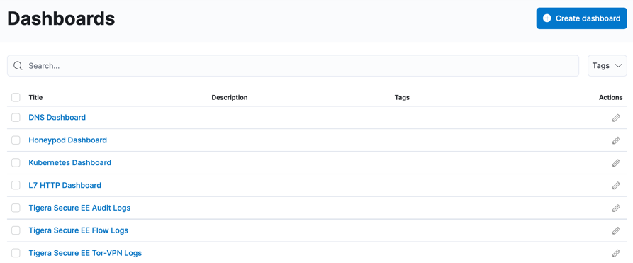

Dynamic Service And Threat Graph
===============

Service Graph is a graph of pod and service communication for all applications within the cluster. Allows for customized views to show relationships between namespaces, services, and deployments.

Explore the `hipstershop` resources in the dynamic service and threat graph. 

- click on the `Service Graph` icon on the left menu which will display a top level view of the cluster resources.
- Double click on the `Hipstershop` Namespace as highlighted to bring only resources in the `hipstershop` namespace in view along with other resources communicating into or out of the `hipstershop` Namespace.
- When you expand the top right panel `<<`, you see a detailed view of the service-to-service communications for the namespace.
- The panel at the bottom below the graph provides tools for troubleshooting connectivity and performance issues. Logs (Flows, DNS, and HTTP) are the foundation of security and observability in Calico Enterprise. When you select a node or edge in the graph, logs are filtered for the node or service.
- Right click any resource to hide or de-emphasize then save the view from the panel on the left `>>`
- Create Layers that allows you to create meaningful groupings of resources so you can easily hide and show them on the graph. For example, you can group resources for different platform infrastructure types in your cluster like networking, storage, and logging.

Flow Visualization
===============

Calico Cloud logs all network flows including source and destination namespaces, pods, labels, and the policies that evaluate each flow. Logs of all connection attempts (inside and outside the cluster) are automatically generated so you can quickly identify source of connectivity issues.

The Flow Visualizer lets you quickly drill down and pinpoint which policies are allowing and denying traffic between their services.

To use the FLow Visualization click on the `Service Graph` icon on the left menu then select `Flow Visualization`.

Kibana & FLow Logs
===============

Calico Cloud includes a fully-integrated deployment of Elasticsearch to collect flow log data that drives key features like the Flow Visualizer, metrics in the Dashboard and Policy Board, policy automation, and testing features and security. Calico cloud also embeds Kibana so you can view raw log data for the traffic within your cluster.

Click on the `Kibana` icon on the left menu.

Calico Cloud comes with built-in dashboards.

Kibana provides its own set of filtering capabilities to drill down into log data. For example, use filters to drill into flow log data for specific namespaces and pods. Or view details and metadata for a single flow log entry.

💡 Exersice:

1- log in to kibana
2- Select DNS Dashboards
3- filter DNS traffic from multitool pod 

Click for Hint

  <pre>add filter `client_name_aggr` is `multitoo`</pre>

4- set time window for the last 2 hours
5- Export DNS Top 10 external domains 

🏁 Finish
=========

## Step 03

If you've viewed the dashboard, click **Check** to finish this track.
