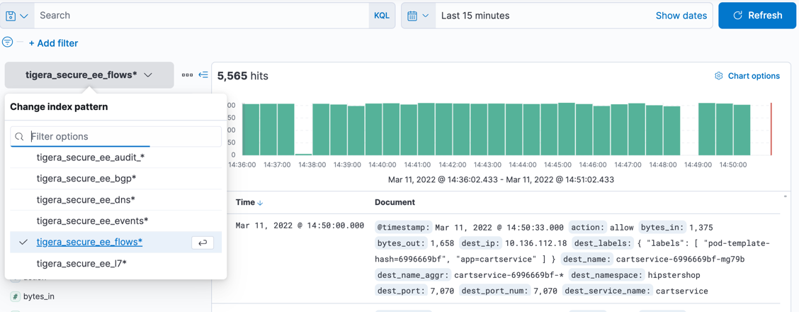

Dynamic Service And Threat Graph
===============

Dynamic Service and Threat Graph is a live visualization of pod and service communication for all applications within the cluster. It also provides customized views to show relationships between namespaces, services, and deployments.

Explore the `hipstershop` resources in the Dynamic Service and Threat Graph.


- Click on the `Service Graph` icon on the left menu which will display a top level view of the cluster resources.
- Double click on the `Hipstershop` Namespace as highlighted to bring only resources in the `hipstershop` namespace in view along with other resources communicating into or out of the `hipstershop` Namespace.
- Expand the top right panel `<<` and get a detailed view of the service-to-service communications for the namespace.
- Browse to the panel at the bottom below the graph to get flow log data which is already corelated and will help troubleshooting connectivity and performance issues faster. When you select a node or edge in the graph, logs are filtered for the node or service.
- Right click any resource to hide or de-emphasize then save the view from the panel on the left `>>`
- Create Layers that allows you to create meaningful groupings of resources so you can easily hide and show them on the graph. For example, you can group resources for different platform infrastructure types in your cluster like networking, storage, and logging.

Flow Visualization
===============

Flow Visualizer lets you quickly drill down and pinpoint which policies are allowing and denying traffic between their services.

To use the FLow Visualization click on the `Service Graph` icon on the left menu then select `Flow Visualization`.


Kibana & FLow Logs
===============

Another helpful visualization for visualizing and troubleshooting compliance violations is fully-integrated deployment of Elasticsearch  that includes built-in custom dashboards.

Click on the `Kibana` icon on the left menu.


For example, use filters to drill into flow log data for specific namespaces and pods. Or view details and metadata for a single flow log entry.



💡 Exercise:

1. log in to Kibana
2. Select DNS Dashboards
3. filter DNS traffic from multitool pod
<details><summary>Click for Hint</summary>
  <pre>add filter `client_name_aggr` is `multitoo`</pre>
</details>
4. set time window for the last 2 hours
5. Export DNS Top 10 external domains


Compliance reports
===============

Using the reporting feature of Calico Cloud you can create a number of reports to satisfy the various PCI DSS and SOC 2 reporting requirements.
Calico Cloud supports the following built-in report types:

- Inventory
- Network Access
- Policy-Audit
- CIS Benchmark

We have already scheduled some reports to run daily .

Check the `GlobalReports` in your environment

```bash
kubectl get globalreports
``` 

For the purpose of the workshop, we will run these reports manually using the following script:

```bash
./run-reports.sh
```

To view the generated reports in Calico Cloud click on `Compliance` from the left menu. You also export the reports.


🏁 Finish
=========

If you've viewed the reports, click **Next** to continue to the next challenge.
