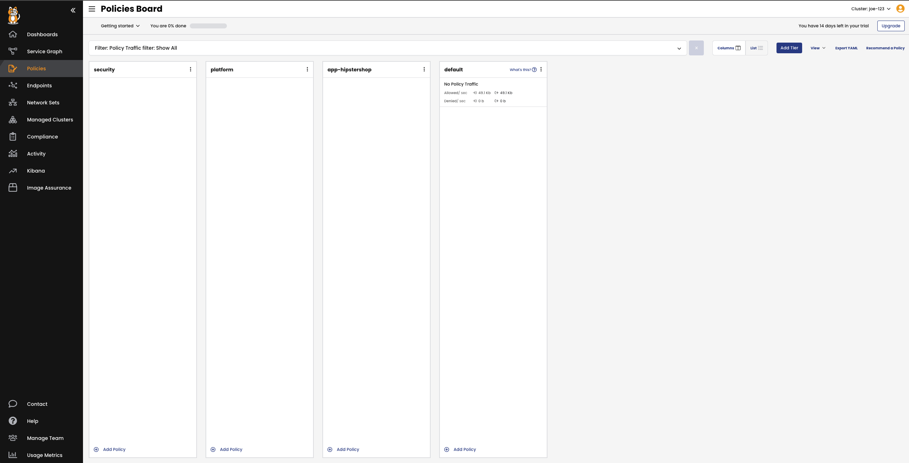

👋 Microsegmentation with Hipstershop
===============
To perform the microsegmentation we will need to know more about how the application communicates between the services. The following diagram provides all the information we need to know:


After reviewing the diagram we can come up with a table of rules that looks like this:

```
Source Service | Destination Service | Destination Port
--- | --- | ---
cartservice | redis-cart | 6379
checkoutservice | cartservice | 7070
checkoutservice | emailservice | 8080
checkoutservice | paymentservice | 50051
checkoutservice | productcatalogservice | 3550
checkoutservice | shippingservice | 50051
checkoutservice | currencyservice | 7000
checkoutservice | adservice | 9555
frontend | cartservice | 7070
frontend | productcatalogservice | 3550
frontend | recommendationservice | 8080
frontend | currencyservice | 7000
frontend | checkoutservice | 5050
frontend | shippingservice | 50051
frontend | adservice | 9555
loadgenerator | frontend | 8080
recommendationservice | productcatalogservice | 3550
```
This results in the following policy which we can now apply to the app-hipstershop tier using:

```bash
kubectl apply -f https://raw.githubusercontent.com/JosephYostos/Compliance-workshop/main/03-showing-the-service/mainfest/2.6-hipstershop-policy.yaml
```
we will have to go back and make a modification to our PCI Restriction and Tenant Isolation Policies to completely enable our microsegmentation. Right now the PCI policy allows communication between all the 'pci=true' pods and the Tenant Isolation policy allows open communication between pods with the 'tenant=hipstershop' label. We want to pass this decision to the 'app-hipstershop' tier so we will apply the following update:

```bash
kubectl apply -f https://raw.githubusercontent.com/JosephYostos/Compliance-workshop/main/03-showing-the-service/mainfest/2.7-pci-policy-update.yaml
kubectl apply -f https://raw.githubusercontent.com/JosephYostos/Compliance-workshop/main/03-showing-the-service/mainfest/2.8-tenant-isolation-update.yaml
```

Once this is applied, the policy inside of the 'app-hipstershop' tier should apply and give us microsegmentation inside of our application namespace. The Policy Board should show traffic being allowed by most of our policies:



✅ Limiting Egress Access
============
Now that we've implemented our microsegmentation policy, there's one last type of policy we should apply; a global egress access policy.

A global egress access policy allows us to limit what external resources the pods in our cluster can reach. To build this we need two pieces:
1. A GlobalNetworkSet with a list of approved external domains.
2. An egress policy that applies globally and references our GlobalNetworkSet.

First, lets created our list of allowed domains:

```yaml
kubectl apply -f -<<EOF
kind: GlobalNetworkSet
apiVersion: projectcalico.org/v3
metadata:
  name: global-trusted-domains
  labels:
    external-endpoints: global-trusted
spec:
  nets: []
  allowedEgressDomains:
    - google.ca
    - tigera.io
EOF
```

And now we'll apply our policy into the security tier and have it reference our list of trusted domains we just created.

```yaml
kubectl apply -f -<<EOF
apiVersion: projectcalico.org/v3
kind: GlobalNetworkPolicy
metadata:
  name: security.global-trusted-domains
spec:
  tier: security
  order: 112.5
  selector: ""
  namespaceSelector: ""
  serviceAccountSelector: ""
  egress:
    - action: Allow
      source: {}
      destination:
        selector: external-endpoints == "global-trusted"
  doNotTrack: false
  applyOnForward: false
  preDNAT: false
  types:
    - Egress
EOF
```

Now any pod that doesn't have a more permissive egress policy will only be allowed to access 'google.ca' and 'tigera.io' and we can test this with our 'multitool' pod in the 'hisptershop' namespace.

First we'll exec into our multitool pod in the 'hipstershop' namespace:
```bash
kubectl exec -n hipstershop multitool --stdin --tty -- /bin/bash
```

And then we'll try to connect to a few domains (google.ca, tigera.io, github.com)
```bash
bash-5.1# ping -c 3 google.ca
PING google.ca (172.217.13.195) 56(84) bytes of data.
64 bytes from yul03s05-in-f3.1e100.net (172.217.13.195): icmp_seq=1 ttl=107 time=2.06 ms
64 bytes from yul03s05-in-f3.1e100.net (172.217.13.195): icmp_seq=2 ttl=107 time=1.75 ms
64 bytes from yul03s05-in-f3.1e100.net (172.217.13.195): icmp_seq=3 ttl=107 time=1.73 ms

--- google.ca ping statistics ---
3 packets transmitted, 3 received, 0% packet loss, time 2004ms
rtt min/avg/max/mdev = 1.729/1.846/2.056/0.148 ms
bash-5.1# ping -c 3 tigera.io
PING tigera.io (162.159.135.42) 56(84) bytes of data.
64 bytes from 162.159.135.42 (162.159.135.42): icmp_seq=1 ttl=46 time=8.41 ms
64 bytes from 162.159.135.42 (162.159.135.42): icmp_seq=2 ttl=46 time=8.53 ms
64 bytes from 162.159.135.42 (162.159.135.42): icmp_seq=3 ttl=46 time=8.10 ms

--- tigera.io ping statistics ---
3 packets transmitted, 3 received, 0% packet loss, time 2001ms
rtt min/avg/max/mdev = 8.103/8.347/8.532/0.180 ms
bash-5.1# ping -c 3 github.com
PING github.com (140.82.112.3) 56(84) bytes of data.

--- github.com ping statistics ---
3 packets transmitted, 0 received, 100% packet loss, time 2028ms
```

As expected our pings to google.ca and tigera.io are successful but our ping to github.com is denied.

Now our policies are complete. 

🏁 Finish
=========

## Step 03

If you've viewed the dashboard, click **Check** to finish this track.
