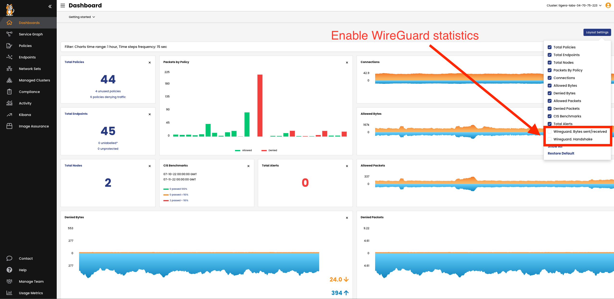

Encrypt data in transit
===============

Calico provideds WireGuard to secure on the wire in-cluster pod traffic in a Calico Enterprise cluster. 

When this feature is enabled, Calico Enterprise automatically creates and manages WireGuard tunnels between nodes providing transport-level security for on-the-wire, in-cluster pod traffic. WireGuard provides formally verified secure and performant tunnels without any specialized hardware.


Install WireGuard
===============

Before enabling end-to-end encryption with Calico, you must first install WireGuard. In this lab WireGuard is installed by deafult.
Instructions available here https://www.wireguard.com/install/ (you don't need to install it as it's already installed)

Test to ensure that the wireguard module is loaded using the following command:

```bash
sudo lsmod | grep wireguard
```

The output should look something like this:

```bash
ubuntu@ip-10-0-1-30:~$ sudo lsmod | grep wireguard
wireguard              81920  0
curve25519_x86_64      49152  1 wireguard
libchacha20poly1305    16384  1 wireguard
libblake2s             16384  1 wireguard
ip6_udp_tunnel         16384  1 wireguard
udp_tunnel             20480  1 wireguard
libcurve25519_generic    49152  2 curve25519_x86_64,wireguard
```

Enable End to End Encryption
===============

To enable end-to-end encryption, we will patch the 'felixconfiguration' with the 'wireguardEnabled' option.

```bash
kubectl patch felixconfiguration default --type='merge' -p '{"spec":{"wireguardEnabled":true}}'
```

To validate, you will need to check the node status for Wireguard entries with the following command:

```bash
kubectl get nodes -o yaml | grep 'kubernetes.io/hostname\|Wireguard'
```

Which will give you the following output showing the nodes hostname as well as the Wireguard Interface Address and PublicKey:

```bash
tigera@bastion:~$ kc get nodes -o yaml | grep 'kubernetes.io/hostname\|Wireguard'
      projectcalico.org/IPv4WireguardInterfaceAddr: 10.48.115.87
      projectcalico.org/WireguardPublicKey: gsxCZHLjKBjJozxRFiKjbMB3QtVTluQDmbvQVfANmXE=
      kubernetes.io/hostname: ip-10-0-1-20.ca-central-1.compute.internal
            f:kubernetes.io/hostname: {}
            f:projectcalico.org/IPv4WireguardInterfaceAddr: {}
            f:projectcalico.org/WireguardPublicKey: {}
      projectcalico.org/IPv4WireguardInterfaceAddr: 10.48.127.254
      projectcalico.org/WireguardPublicKey: HmNsTyzg7TKvs/Fh0AmA0VEgtS+Ij6xBHqvzXO5VfmA=
      kubernetes.io/hostname: ip-10-0-1-30.ca-central-1.compute.internal
            f:kubernetes.io/hostname: {}
            f:projectcalico.org/IPv4WireguardInterfaceAddr: {}
            f:projectcalico.org/WireguardPublicKey: {}
      projectcalico.org/IPv4WireguardInterfaceAddr: 10.48.116.146
      projectcalico.org/WireguardPublicKey: lDSws3G/G1KP76BGGRpVSXBnTt5N6FCqOodzTUUWs0I=
      kubernetes.io/hostname: ip-10-0-1-31.ca-central-1.compute.internal
            f:kubernetes.io/hostname: {}
            f:projectcalico.org/IPv4WireguardInterfaceAddr: {}
            f:projectcalico.org/WireguardPublicKey: {}
```

On your node you can also view the new interface created by Wireguard with the 'wg' command:

```bash
ubuntu@ip-10-0-1-30:~$ sudo wg
interface: wireguard.cali
  public key: HmNsTyzg7TKvs/Fh0AmA0VEgtS+Ij6xBHqvzXO5VfmA=
  private key: (hidden)
  listening port: 51820
  fwmark: 0x200000

peer: gsxCZHLjKBjJozxRFiKjbMB3QtVTluQDmbvQVfANmXE=
  endpoint: 10.0.1.20:51820
  allowed ips: 10.48.115.64/26, 10.48.115.87/32, 10.0.1.20/32
  latest handshake: 1 minute, 26 seconds ago
  transfer: 22.09 MiB received, 12.46 MiB sent

peer: lDSws3G/G1KP76BGGRpVSXBnTt5N6FCqOodzTUUWs0I=
  endpoint: 10.0.1.31:51820
  allowed ips: 10.48.116.128/26, 10.48.116.146/32, 10.0.1.31/32
  latest handshake: 1 minute, 27 seconds ago
  transfer: 23.64 MiB received, 13.21 MiB sent
```

View WireGuard statistics
===============
To view WireGuard statistics in Manager UI, you must enable them. From the left navbar, click Dashboard, and the Layout Settings icon.




🏁 Finish
=========

## Step 03

If you've viewed the dashboard, click **Check** to finish this track.
